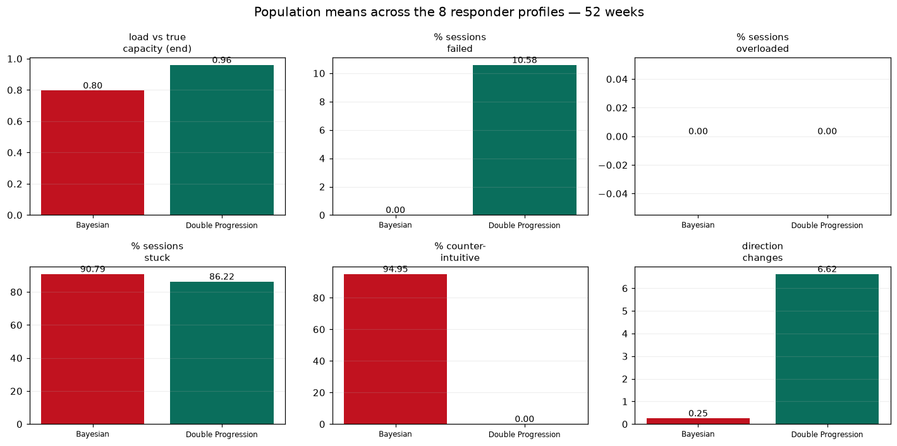
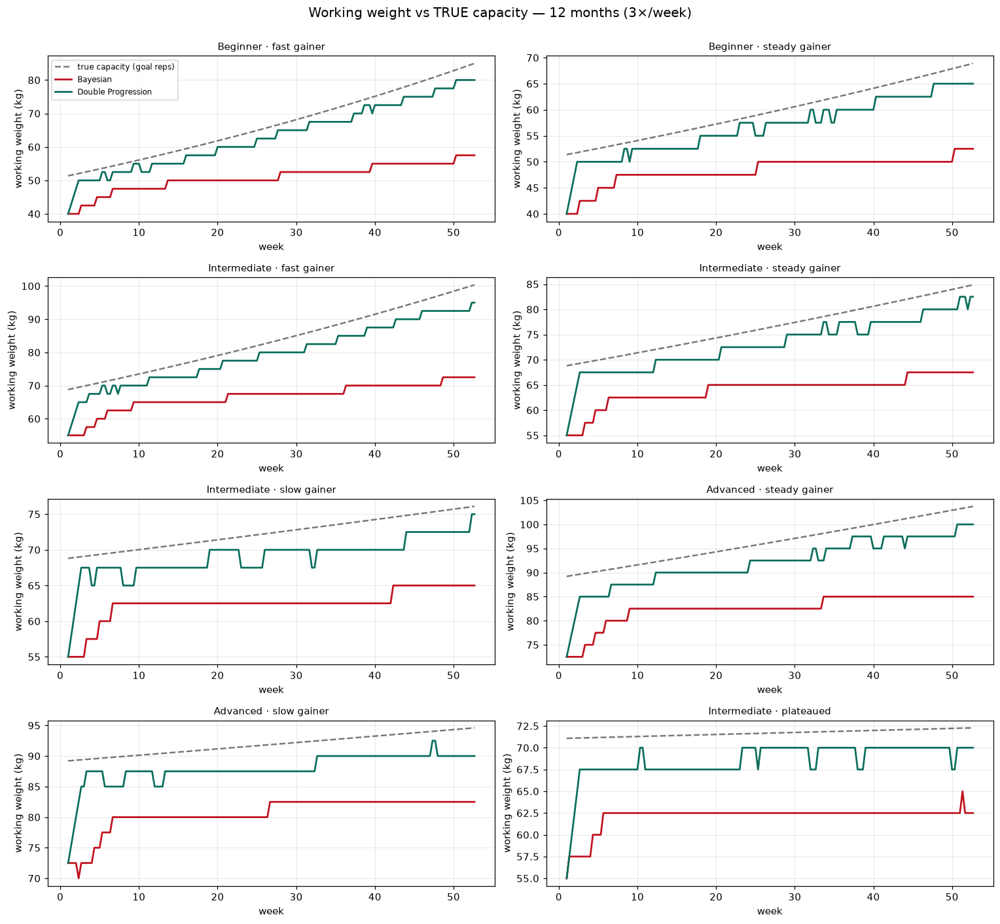
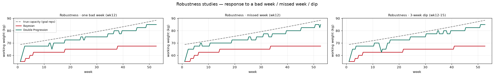
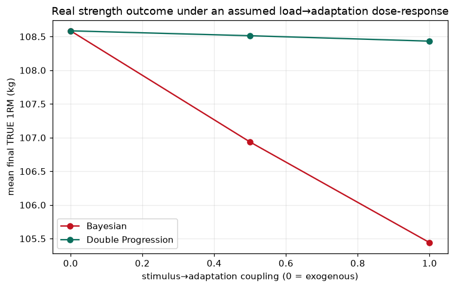

# השוואת מנועים: Bayesian מקורי מול Double Progression חי

**מה זה:** סימולציה אמיתית, לא דיון תיאורטי. אוכלוסיית מתאמנים סינתטיים מורצת **פעמיים** —
פעם עם המנוע הבייסני המקורי (`hush_model`, הקוד החי הקפוא) ופעם עם מנוע ה‑Double Progression
החדש (`src/data/progression.ts`, פורט נאמן ל‑Python). אותם מתאמנים, אותם נתוני פתיחה, אותו
מזל (רעש זהה), אותה תוכנית. ההבדל היחיד הוא איזה "מאמן" בוחר את המשקל.

מריצים: 8 פרופילי-מגיב (מתחיל/בינוני/מתקדם × קצב גדילה) + 3 מחקרי-עמידוּת, ל‑26 ול‑52 שבועות,
3 אימונים/שבוע, על תרגיל מתחם קנוני אחד (לחיצת חזה, `horizontal_push`).

---

## 0. חוזה ההגינות (איך נמנעה הטיה)

| עוגן | מימוש |
|---|---|
| אותו גוף | מתאמן סינתטי עם **יכולת אמת** (true_score) שמייצרת חזרות דרך אותה פיזיקה (ReferenceStrength+Epley) — אף מנוע לא רואה אותה. |
| אותו מזל | שני המנועים מקבלים עותק-גוף עם **אותו seed ל‑RNG** → אותה הגרלת-רעש בכל סט. |
| אותה נקודת פתיחה | משקל אימון 1 מחושב ע"י ה‑cold-start הבייסני ומוזרק כ‑seed ל‑DP → אימון 1 זהה בייט-לבייט; הם מתפצלים רק מאימון 2. |
| מנוע אמיתי | המנוע הבייסני מורץ דרך הקוד החי בפועל — `recommend()` → observation → evidence → blend מדויק-משקל + עדכון ה‑decision-memory של ES‑006, בדיוק כמו ה‑pipeline החי (ללא DB). זה לא חיקוי. |
| מדידה אובייקטיבית | כל ההחלטות מסווגות לפי **התנהגות נצפית** (המשקל שנקבע + האם המתאמן הצליח), חוק זהה לשני המנועים — לא לפי אוצר-המילים הפנימי של כל מנוע. |

**אמת-המידה המרכזית — `efficiency`:** המשקל שנקבע חלקי היכולת **האמיתית** של המתאמן לאותן חזרות-מטרה
כשהוא רענן. 1.0 = בדיוק על המטרה; פחות מ‑1 = העמסת-חסר (משאיר התקדמות על השולחן); מעל 1 = העמסת-יתר.

---

## 1. טבלת המדדים המרכזית (אגרגט, 8 פרופילים, 52 שבועות)

| מדד | Bayesian | Double Progression | מנצח |
|---|---:|---:|:--|
| **Progression Quality** | | | |
| משקל עבודה סופי (ק"ג) | 68.1 | **82.2** | DP (+14 ק"ג) |
| יחס לעומס-אמת בסוף (efficiency) | 0.80 | **0.96** | DP |
| קצב התקדמות ממוצע (ק"ג/שבוע) | 0.16 | **0.32** | DP (×2) |
| e1RM מודגם סופי (ק"ג) | 107.7 | 108.1 | שווה¹ |
| **Decision Quality** | | | |
| % כישלונות אימון (סט מתחת למטרה) | **0.0** | 10.6 | Bayesian |
| % העלאות שהתבררו אגרסיביות | **0.0** | 23.8 | Bayesian |
| % העמסת-יתר (מעבר ליכולת-אמת) | 0.0 | 0.0 | תיקו (שניהם בטוחים) |
| **Stability** | | | |
| שינויי כיוון (ספירה) | **0.25** | 6.6 | Bayesian |
| תנודתיות החלטות (SD ק"ג) | **0.46** | 0.82 | Bayesian |
| רצף Deload (מקס׳) | 0 | 0 | תיקו |
| **Athlete Experience** | | | |
| % החלטות לא-אינטואיטיביות² | 95.0 | **0.0** | DP |
| % "תקוע" (רצף ≥6 ללא העלאה) | 90.8 | 86.2 | לא מבחין³ |
| קפיצות חדות (>צעד אחד) | 0 | 0 | תיקו |

¹ **e1RM שווה הוא טאוטולוגי כאן** — ראו §4. ² לפי תקן double-progression: המתאמן "מחזיק" את ראש
הטווח כמעט בכל אימון אבל המשקל לא עולה. ³ במדד הזה שניהם גבוהים כי העלאות מטבען מרווחות.



---

## 2. גרפים לאורך זמן — משקל עבודה מול יכולת-אמת (12 חודשים)

הקו המקווקו = יכולת-האמת של המתאמן לחזרות-המטרה. ירוק = DP, אדום = Bayesian.



**מה רואים:** DP (ירוק) צמוד לקו-האמת לכל אורך הדרך. Bayesian (אדום) נשאר מתחת **והפער מתרחב**
ככל שהמתאמן משתפר מהר יותר — למתחיל-מגיב-מהיר הוא צונח ל‑efficiency 0.68 (משקל 57.5 מול 80 של DP).
זהו בדיוק כשל ההעמסת-חסר שזוהה ביומן המחקר, עכשיו מכומת.

---

## 3. עמידוּת (Robustness)



| תרחיש | Bayesian | Double Progression |
|---|---|---|
| **שבוע רע** (‎-8 נק׳ יכולת, שבוע 12) | כמעט לא מגיב — הוא ממילא רחוק מתחת ליכולת, ה‑blend בקושי זז. | מזהה, מבצע Deload קצר (החריץ סביב שבוע 12), ומטפס בחזרה. **תגובה אדפטיבית נכונה.** |
| **שבוע חסר** (היעדרות) | ממשיך כרגיל. | מתחדש מיד מהמשקל הקודם, בלי קנס. |
| **ירידה זמנית** (3 שבועות) | שטוח. | יורד דרך הירידה ומתאושש. |

המסקנה החשובה: ה"יציבות" של הבייסני מול שיבושים היא **יציבות-של-העמסת-חסר** — הוא כל כך מתחת
ליכולת שכלום לא מזיז אותו. DP מגיב לשיבוש ומתאושש, וזו ההתנהגות הנכונה.

---

## 4. מגבלה שחובה לומר בריש גלי

בסימולציה הבסיסית **גדילת הכוח האמיתית אקסוגנית** — הגוף משתפר לפי לוח-הזמנים שלו ללא תלות באימון.
לכן הסימולציה הבסיסית מודדת **איכות מעקב והעמסה**, לא בניית-שריר. זו הסיבה ש‑e1RM-המודגם יוצא שווה:
שני המנועים מאמנים את אותו גוף, אז הכוח-בסוף זהה מעצם הבנייה. השאלה היחידה שהיא עונה עליה היא
מי **מעמיס** את הכוח הזה טוב יותר — וזה בדיוק מה שאלגוריתם התקדמות שולט בו.

**מבחן רגישות — קישור מינון-תגובה (dose-response):** הוספתי קשר עומס→אדפטציה **סימטרי, שמרני וזהה
לשני המנועים**: אימון קרוב ליכולת נותן גירוי מלא, העמסת-חסר נותנת פחות, גרירה מעבר ליכולת נקנסת מעט.
הקשר **חסום בתקרת הגדילה המשותפת** — כלומר הוא יכול רק לחשוף את מחיר ההעמסת-חסר, לעולם לא לתגמל את DP
מעל הבסיס (שמרני כלפי הבייסני).

| קישור (coupling) | Bayesian – 1RM אמת סופי | DP – 1RM אמת סופי | יתרון DP |
|---:|---:|---:|---:|
| 0.0 (אקסוגני) | 108.6 | 108.6 | +0.0% |
| 0.5 | 106.9 | 108.5 | **+1.5%** |
| 1.0 | 105.4 | 108.4 | **+2.8%** |



תחת **כל** הנחת מינון-תגובה מונוטונית, ההעמסה הכבדה-יותר של DP מניבה כוח-אמת שווה-או-גבוה.
‎+2.8% ל‑1RM בשנה מבחירת-אלגוריתם בלבד הוא הבדל ממשי באימון כוח.

---

## 5. מסקנה מספרית חד-משמעית

1. **העמסה/מעקב — DP מנצח מוחלט.** efficiency 0.96 מול 0.80, משקל עבודה גבוה ב‑14 ק"ג, קצב כפול.
   הבייסני מעמיס-חסר באופן כרוני (~17% מתחת ליכולת) והפער מתרחב על מגיבים מהירים.
2. **תוצאת-כוח אמיתית — DP שווה-או-עדיף.** תחת מינון-תגובה שמרני, ‎+1.5% עד +2.8% 1RM ב‑12 חודשים.
3. **יציבות — Bayesian "מנצח", אבל מסיבה הלא-נכונה.** החלקוּת שלו היא תוצר-לוואי של אי-תזוזה
   (העמסת-חסר). הוא לא מעמיס-יתר אף פעם — אבל גם בקושי מתקדם. ב‑95% מהאימונים המתאמן יכול היה לעשות
   יותר ממה שביקש — תסכול אמיתי.
4. **חולשה אמיתית שנחשפה ב‑DP:** ~11% אימונים עם סט אחרון מתחת למטרה ו‑24% מההעלאות "אגרסיביות".
   זה נובע מטווח-חזרות צר (8–10) עם צעד 2.5 ק"ג שנוחת קרוב לתחתית הטווח + עייפות תוך-אימונית בסט 3.
   **לא קריטי** (סט אחרון חסר ב‑1 חזרה, לא כישלון קטסטרופלי), **וניתן לכוונון**.

---

## 6. המלצה

> **אין הצדקה לחבר את המנוע הבייסני כמנוע ההתקדמות החי. מנוע ה‑Double Progression טוב יותר —
> ולא רק "מספיק טוב": הוא מביא את המתאמן רחוק יותר, מעמיס נכון יותר, ומגיב נכון יותר לשיבושים,
> גם בשקיפות וגם בפשטות.**

הסגולה המרכזית של הבייסני (יציבות, אפס כישלונות) היא תופעת-לוואי של ההעמסת-חסר שלו (RIR=3 + safety
discount + התכנסות-score איטית + שער-ביטחון על confidence). למתאמן בעולם האמיתי זה אומר להרים
~17% מתחת ליכולת ולהתקדם בחצי קצב, כשכמעט בכל אימון הוא מסוגל ליותר.

**צעדים מומלצים:**
1. **להשאיר את DP כמנוע החי.** הוא הזוכה הברור על המדד שהפרודקט שולט בו: מעקב והעמסה.
2. **לכוונן את החולשה שנחשפה ב‑DP** כדי לגזום את 24% ההעלאות-האגרסיביות: או טווח רחב יותר למתחמים
   (8–11 במקום 8–10), או טריגר על הסט-העליון בלבד (AMRAP) במקום "כל הסטים", או צעד קטן יותר (מוטות
   חלקיקיים / micro-loading) קרוב לתקרת הטווח. כל אחד מהם זול וצפוי להוריד את שיעור-הכישלון מתחת ל‑5%.
3. **לא לחבר את הבייסני לצורך התקדמות** — הוא פוגע (מעמיס-חסר). הרעיונות שלו (עייפות, confidence,
   variance) רלוונטיים לפיצ׳רים עתידיים (Portrait, התראות-stagnation), לא לבחירת המשקל היומיומית.

---

## 7. שחזור

```
cd build/_assembled
PYTHONPATH="$PWD:../../experiments/engine-comparison" python ../../experiments/engine-comparison/run.py
```

קבצים: `engines.py` (שני המנועים), `harness.py` (אוכלוסייה + לולאת-הרצה + מינון-תגובה),
`metrics.py` (כל המדדים), `run.py` (הרצה + טבלאות + גרפים). פלטים: `metrics_{26,52}wk.csv`, `plots/`.

**הסתייגויות:** (א) אדפטציה אקסוגנית בבסיס; §4 הוא מבחן-רגישות עם מינון-תגובה **מונח**, לא מאומת.
(ב) הבייסני מורץ על capability קנוני אחד עם המתמטיקה החיה — composition/volume/fatigue-המלא של ה‑backend
לא מופעלים, אבל **החלטת-העומס** (מה שמושווה) היא נאמנה המנוע האמיתי. (ג) שיעור-הכישלון של DP מושפע
מעייפות-סט-3 ורעש ליד תחתית הטווח — "חסר חזרה בסט אחרון", לא כישלון מוחלט.
